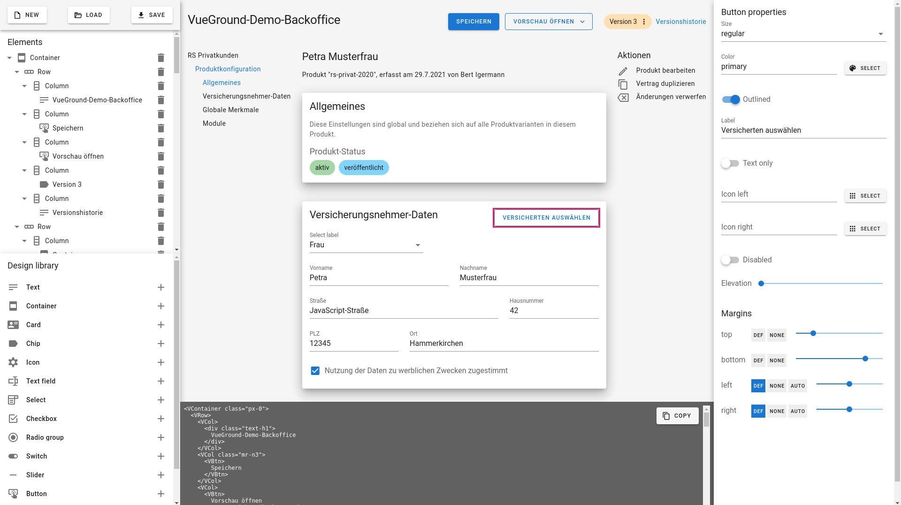

# VueGround

A **UX design tool** using your **production Vue components** to edit and render UX screens.

More specifically, as a living example, a visual playground for [Material](https://material.io/design) designs made with [Vuetify](https://vuetifyjs.com/).

<br/>

<br/>
<br/>

## Aim and background

As a developer, we usually get designs that do not use the target medium: **the web**.

They are done in tools like [Sketch](https://www.sketch.com/) or [Figma](https://www.figma.com/), and often contain details that do not match existing (implemented) UI components or screens. Screens or parts have diverged, because the designer does not have access to a library of already-implemented solutions.

VueGround (as a [Vue](https://vuejs.org/) successor of [Alva](https://meetalva.io/)) tries to solve this by providing the UX designer with a tool that uses the **production Vue components**. They drag-drop and configure these components into a canvas (which is an actual Vue/Nuxt webapp), and generate screens you and the designers can iterate on.

Because the actual medium and the production components are used, the designer is limited, and requires fast iterations from the developers to create new screens. This fosters communication and collaboration and helps to build deep understanding on both sides.

We get a truely **cross-functional team** 🎉

## Quickstart

Prerequisites:

- Node 14 or later
- Yarn

### Local maschine

Run this to build and run VueGround on your local machine, using Vuetify as an example Library (see below).

```bash
yarn install
yarn dev
```

Then open [this example](./example/backoffice.vgm) in VueGround. You will see a Backoffice page made with Vuetify. Play around and enjoy.

### Production build (to host somewhere)

```bash
yarn install
yarn build
yarn start
```

## Concepts

Now that you got it running, let's start with some terms, to be on the same page:

- **Library:** A list of supported Components, defining the props the UX designer can interactively tweek.
- **Component:** One of the components of the Library. Components include an implementation using the designer's props to display the design in the Canvas, using real production code and frontend libraries (like Vuetify).
- **Element:** An instance of a Component. If you have put three buttons into the Canvas, then "button" is the one Component, but you have three Elements. Each Element has its own props to be set.
- **Model:** The file you save and load in VueGround, consisting of the Elements tree and all its settings. VueGround Models have a "vgm" file suffix.
- **Canvas:** The middle area of VueGround where you put Elements in. Elements can nest, so the Canvas is basically a visual representation of the Elements tree, the Model.

## Library

Let us now have a closer look at the Library and Components concepts.

The Library is the set of supported components for the UX designer to use. These Components

- have a **name** and an **icon**
- defining the **props** the UX designer can interactively tweek, like labels, primary/secondary button, alignment, colors, spacing, etc.
- implement their **visual representation** using real project code and libraries (like Vuetify)
- specify which **children they support** (you saw that, in VueGround, the available Components change dynamically, right?)

## Vuetify example Library

In [library/vuetify](./library/vuetify) you'll find an example implementation of a Library. This default Library is used when you just start VueGround.

## Your own project Library

To adapt to your frontend project, implement a Library file just like vuetify.ts. Specify the Components you want to offer to your designers, their props, and provide an implementation to render in the Canvas.

To activate/use the new Library, please change the reference in [library/index.ts](./library/index.ts). Sorry, currently, this is the only way to do, but maybe you can help improve VueGround to read Library files dynamically?

## Example model

In (example)[./example] you'll find an example backoffice page made with the Vuetify example Library. Just start VueGround or use [this hosted version](https://vueground.thomasjacob.de), and click "Load".

## Hosted Vuetify VueGround

I also host the most recent version of VueGround with the Vuetify example Library, for demo purposes:

Give it a try: https://vueground.thomasjacob.de
